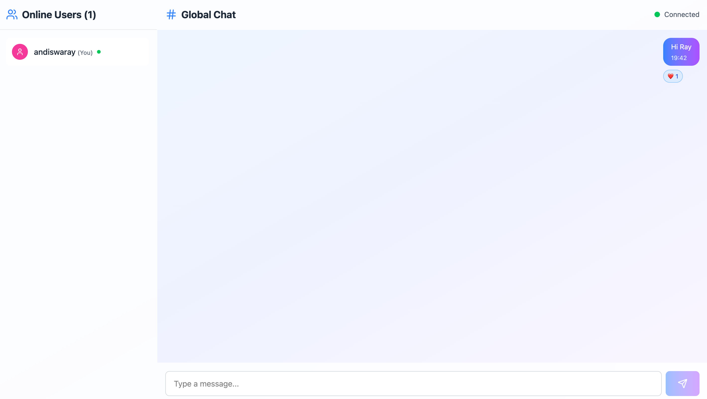

# 📡 Real-Time Chat App

A full-stack real-time chat application built with **React**, **Socket.IO**, **Node.js**, and **Express**, featuring public and private messaging, typing indicators, online user tracking, reactions, and a clean Google-inspired UI.

---

## 🛠️ Tech Stack

- **Frontend**: React, Vite, Socket.IO Client  
- **Backend**: Node.js, Express, Socket.IO  
- **Styling**: Plain CSS (Google theme-inspired)  
- **Others**: UUID, React Router, Lucide Icons (optional)

---

## 🚀 Features

- ✅ Real-time global chat  
- ✅ Private 1:1 messaging  
- ✅ Typing indicators (public & private)  
- ✅ Online users panel  
- ✅ Emoji reactions  
- ✅ System join/leave notifications  
- ✅ Smooth UI with custom CSS theme  

---

## 📸 Screenshots

| Login Page | Chat Room |
|------------|-----------|
|  |  |


---

## 📁 Project Structure

real-time-chat-app/
├── client/
│ ├── src/
│ │ ├── components/
│ │ ├── hooks/
│ │ ├── App.jsx
│ │ ├── index.css
│ │ └── main.jsx
│ └── vite.config.js
├── server.js
├── package.json (backend)
└── README.md


---

## ⚙️ Installation

### 1. Clone the repository

```bash
git clone https://github.com/your-username/real-time-chat-app.git
cd real-time-chat-app
```

### 2. Install backend dependencies 
```bash
 pnpm install
```

### 3. Start the backend 

```bash
pnpm run dev
```

### 4. Set up the frontend
```bash
cd client/real-time-chat-app
pnpm install
pnpm run dev
```

### Access the App 
Frontend: http://localhost:5173

Backend (WebSocket): http://localhost:5000

### Environment Variables 
```bash env
PORT=5000
```

### Future Enhancements 

✅ Message search

✅ Message pagination

✅ Responsive mobile layout

❌ Audio/video support (future)

❌ User authentication (future)

### Author 

Andiswa Cyria
Feel free to fork, contribute, or contact me for improvements!


